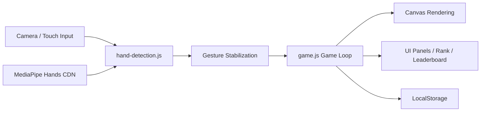

# 指尖星球 | Fingertip Planet


一款基于浏览器摄像头的 AI 手势体感闯关游戏。

玩家通过手势或触摸输入完成挑战，收集能量、提升段位、修复星球。项目目标是把手部训练从“重复动作”变成“有节奏、有反馈、有成长感”的交互体验。

## 目录
- [项目亮点](#项目亮点)
- [玩法模式](#玩法模式)
- [手势识别能力](#手势识别能力)
- [段位与成长系统](#段位与成长系统)
- [技术架构](#技术架构)
- [项目结构](#项目结构)
- [快速开始](#快速开始)
- [配置说明](#配置说明)
- [兼容性与性能建议](#兼容性与性能建议)
- [FAQ](#faq)
- [Roadmap](#roadmap)
- [致谢](#致谢)

## 项目亮点
- 实时手势识别：基于 MediaPipe Hands 识别石头、剪刀、布，并支持点赞/OK 扩展手势配置。
- 多玩法融合：包含能量同步站、怪兽能量战、指尖修复舱三种核心模式。
- 双输入兜底：摄像头不可用时，可切换触摸试玩 Demo 模式进行完整体验。
- 游戏化成长：连击、狂暴、总能量、段位晋级、每日奖励、排行榜等体系联动。
- 移动端友好：内置摄像头权限引导、前后摄切换策略与安全上下文检查。
- 本地优先：本地存储玩家数据，不依赖后端即可运行主流程。

## 玩法模式

### 1. 能量同步站（normal）
- 系统给出目标手势（石头/剪刀/布）。
- 玩家在时限内做出匹配手势得分。
- 连续成功会提高连击并加速能量积累。

### 2. 怪兽能量战（challenge）
- 与怪兽进行手势对抗。
- 根据提示决定是否“克制怪兽”或“故意被克制”。
- 训练快速决策与手势切换能力。

### 3. 指尖修复舱（repair）
- 按指令完成目标手势并保持一段时间。
- 进度条达到 100% 即完成修复。
- 支持简单/标准/困难难度。

### 4. 触摸试玩 Demo
- 不调用摄像头，使用屏幕按钮模拟手势。
- 适合投屏演示、权限受限设备和课堂教学场景。

## 手势识别能力

### 当前支持手势
- `rock`（石头）
- `paper`（布）
- `scissors`（剪刀）
- `like`（点赞，可配置启用）
- `ok`（OK，可配置启用）

### 识别稳定化策略
- 多帧稳定判定（`minStableFrames`）
- 未知手势宽限（`unknownGraceFrames`）
- 摄像头约束回退（优先前/后置失败后自动降级）

## 段位与成长系统

### 段位星系（1-8）
水星 -> 金星 -> 地球 -> 火星 -> 木星 -> 土星 -> 天王星 -> 海王星

### 成长要素
- 单局得分与累计总能量
- 连击与狂暴状态
- 排行榜（今日/总榜/好友）
- 每日奖励与晋级反馈

### 晋级条件示例
- 完成局数
- 怪兽战胜利次数
- 同步正确总次数
- 连续高分局数
- 修复舱全难度完成

## 技术架构



## 项目结构

```text
.
├─ index.html           # 页面结构、模式入口、弹层与 UI 容器
├─ style.css            # 样式、动画、响应式布局
├─ game.js              # 主循环、玩法逻辑、段位/排行榜/奖励系统
├─ hand-detection.js    # 摄像头管理、MediaPipe 初始化、手势识别与稳定化
└─ README.md            # 项目文档
```

## 快速开始

### 环境要求
- 现代浏览器：Chrome / Edge（推荐最新版）
- 支持摄像头权限（可选，触摸试玩不强制）
- 建议在 HTTPS 或本地可信地址运行

### 方式一：Python 本地服务器（推荐）

```bash
python -m http.server 8000
```

打开：

```text
http://127.0.0.1:8000
```

端口冲突时：

```bash
python -m http.server 8001
```

### 方式二：VS Code Live Server
右键 `index.html` -> Open with Live Server。

## 配置说明

### 1) 修复舱 AI 建议
- 界面包含 DeepSeek API Key 输入框（可选）。
- 未填写 Key 仍可使用默认训练方案进入游戏。

### 2) 手势识别参数（代码可调）
- `allowLike`: 是否启用点赞识别
- `allowOk`: 是否启用 OK 识别
- `minStableFrames`: 手势稳定所需连续帧数
- `unknownGraceFrames`: 连续未知帧阈值

### 3) 数据存储
- 使用浏览器 LocalStorage 保存：
  - 总能量
  - 当前段位
  - 历史成绩
  - 每日奖励状态

## 兼容性与性能建议

### 识别更稳定的小技巧
- 保证手部光照充足，避免背光。
- 手部尽量完整入镜，避免遮挡。
- 相机与手保持中距离，减少快速抖动。
- 关闭其他占用摄像头的软件。

### 移动端建议
- 使用系统浏览器打开。
- 优先使用 HTTPS 页面。
- 首次进入按提示手动授权摄像头权限。

## FAQ

### Q1：直接双击 HTML 为什么打不开完整功能？
A：浏览器会限制模块和摄像头调用。请通过本地服务器访问。

### Q2：出现 `net::ERR_ABORTED` 或 `localhost` 无响应怎么办？
A：通常是服务未启动或端口冲突。请重启服务并更换端口。

### Q3：摄像头权限被拒绝后还能玩吗？
A：可以，使用“触摸试玩 Demo”即可体验核心流程。

### Q4：识别总是误判怎么办？
A：优先优化光照与手部姿态，再适当调高手势稳定帧数参数。

## Roadmap
- 增加更多康复动作模板与分阶段训练计划
- 增加多人同屏/异步对战玩法
- 增加训练数据可视化（周/月趋势）
- 增加可选离线资源包与模型缓存机制

## 致谢
- [MediaPipe Hands](https://developers.google.com/mediapipe): 高性能手部关键点检测能力

---


